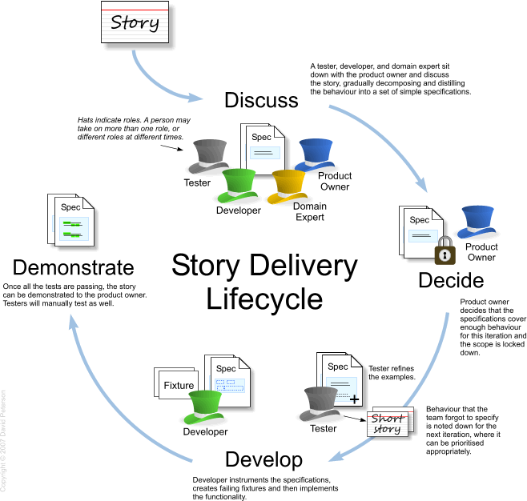
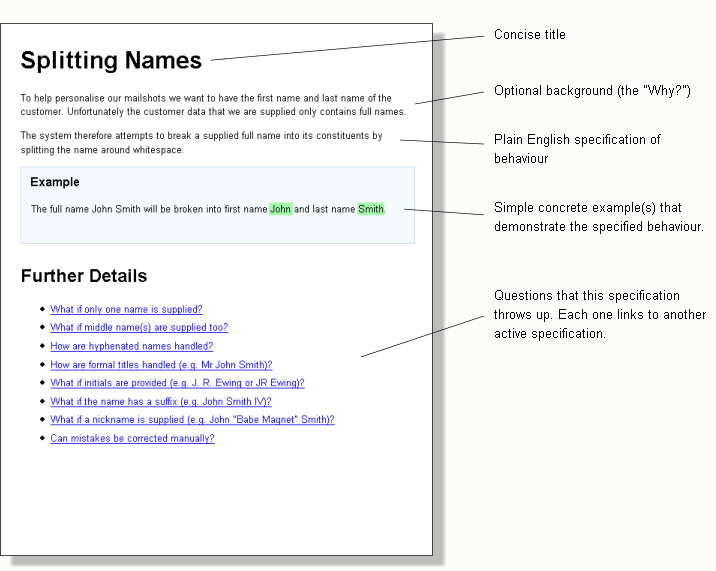

# Process Overview

Story delivery life cycle.

1. Pick a story
1. Agree acceptance criteria
1. Develop functionality
1. Demonstrate and sign off

## Agree acceptance criteria

> "How do we know when a story is done?"

Once you've selected a story from the option list (backlog), you can work it up in terms of acceptance criteria. The idea here is to describe the requirements not in terms of a traditional test script (a series of instructions to follow) but as an english description of the business goals. It's a subtle difference which we'll explore more later.

With more of a _specification_ based approach, you describe the high level business flow in plain english. You're not concerned with the details of how this might be implemented. It's a chance to focus on the business intent and make sure everyone involved understands what's required, the terms and the business context.

This is done with the business or customer.

A typical way to do this is to arrange a session where the business and development team get together to define some basic stories. It's likely the business know what's coming up and this session's goals are to put some of these down on paper as stories. Each story should be discussed, it's goals outlined and the developers can start to think about how it might be realised with the system design.

D> ## What's a Story? {#whats-a-story-aside}
D>
D> There is often some debate about the definition of a story. For the purpose of this discussion, lets assume that a story is just a way to decompose the requirements into achievable chunks that, if implemented, would add _business value_.
D>
D> It's common to physically write the story description on an index card. Teams might then use this as a token on the team's project board to visualise it's task management, moving from left to right to indicate progress.

You'd then attempt to define some acceptance criteria.

D> ## Do we need a meeting to agree acceptance criteria?
D>
D> You don't need a meeting to define acceptance criteria, in fact, its great if you can keep discussing and clarifying them as you need to. You may find it useful to have a kick-off meeting where you can discuss a story's background, context and goals.
D>
D> Note that I'm not talking about an _iteration planning_ meeting here, more like a story definition meeting. The difference is that we're not trying to _plan_ which stories are being played in an iteration. Instead we want to work up the teams understanding of a story. To be most efficient, some analysis work should have already been undertaken.

Once you've written the criteria down, you can attempt to agree them with interested parties. We'll brush over how best to physically record the criteria but we'd aim to have them in a format that will help us later when we come to convert them into executable tests. For arguments sake, you might record these on a Wiki, HTML pages associated with the project source or just on the back of the story card.

Remember that all this is done before writing any production code.

A> ## Define acceptance criteria check list {#define-acceptance-criteria-check-list-aside}
A> - Business analysis has been undertaken.
A> - Developers understand the business background, context and goals for a story.
A> - There is no ambiguity about business terms and everyone agrees of their definition.
A> - Acceptance criteria have been discussed and documented.

D> ## Stickers as sign-off {#stickers-as-sign-off-aside}
D>
D> A great technique to visualise progress of a story is to use stickers to represent agreement or sign-off at the various stages. For example, when a business analyst agrees to the acceptance criteria, a story's index card might get a green sticker. When a testers agrees, a blue sticker and when developers agree, a yellow one. You can have as many stickers as you like or use columns on your board.
D>
D> The whole purpose of the define, agree, develop, demo cycle is to spot problems early and adjust. In that spirit, it makes sense to prevent progress to the next step until previous steps have be completed. For example, don't start development until you have the full set of stickers. If this causes delays and 'blocked' work, missing stickers can help highlight where the bottleneck lies.

D> ##Specification by example {#specification-by-example-aside}
D>
D> Specification by example is a way to describe your requirements using realistic examples. Rather than trying to express requirements through abstract statements, you'd typically describe the context in english and follow it with example scenarios which when executed would hold true for a system implementing the requirements correctly.
D>
D> Following the process outlined in this book would naturally lead to a degree of specification by example. Don't get hung up on the term, I see it as just a useful label for the way we might naturally express requirements. If it's useful to think up examples to get your point across, go for it.
D>
D> Balancing enough scenarios to cover functionality without repeating yourself is key. When done right, they should form a accessible record of how the system behaves. We'll look at some examples using Concordion in [Part 3](#part3)

## Develop

## Demonstrate

